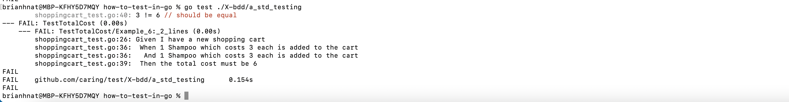
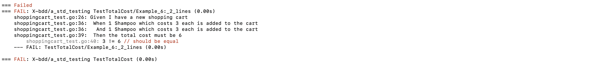

# Incorporating Gherkin-like Syntax using the standard testing library

The simplest approach is to simply utilize the standard testing library, and decorate the test with some Given, When, Then statements utilizing t.logf.
This can help document what the intended behavior of the system is.  It also can add some valuable output to the console when examining errors.
Having the entire scenario output on a test failure can provide some useful context immediately in the output prior to digging through the tests to
find the line where the failure occurred.

Output from go test will look like this:

Output from gotestsum will look like this:
