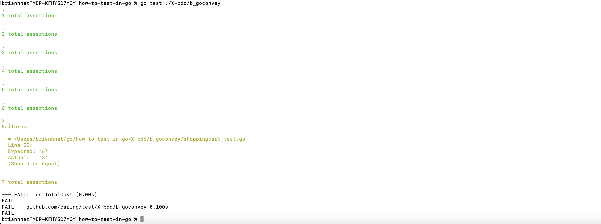

# Utilizing a library like goconvey

This test utilized [goconvey](https://github.com/smartystreets/goconvey). See [goconvey.co](http://goconvey.co) to see additional information about functionality such as:
- live results in your browser
- desktop notifications
- code coverage
- assertions

One of the main advantages of using a library like goconvey is that encourages you to incorporate more natural language into your tests, so that it is more
expressive and easier to trace your code/tests back to business requirements, operational processes, and acceptance criteria.

Output from go test will look like this:

Output from gotestsum will look like this:

Other similar libraries include [ginko](https://onsi.github.io/ginkgo/).