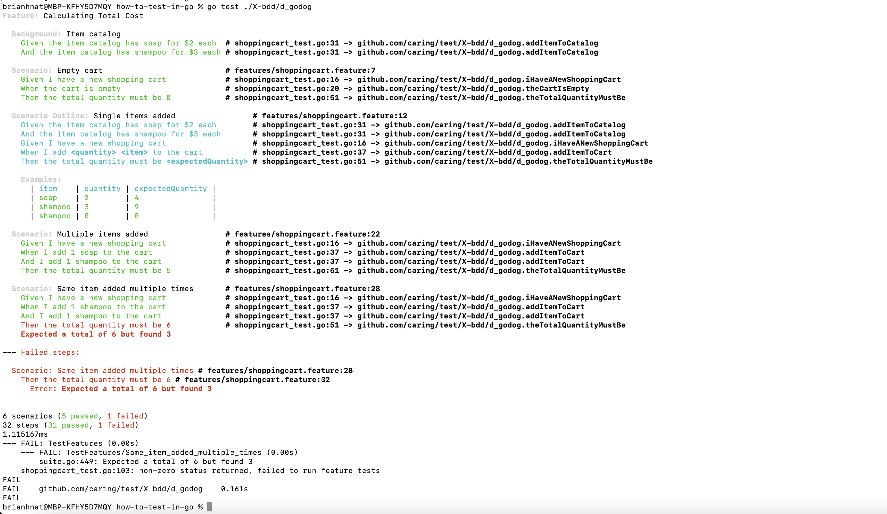

# GODOG

References: 
- https://github.com/cucumber/godog
- https://cucumber.io/docs/gherkin/reference/

This library pulls the given-when-then's into a separate feature file with one or more scenarios. That allows you to better capture the acceptance criteria and 
gives you a tool where you can better collaborate with operations/business users, since the feature file is readable by non-technical people.

The advantage that godog had over gobdd is that the maintainers of cucumber are leading an effort to fold the gobdd funcationality into the godog project.
- https://github.com/go-bdd/gobdd/issues/137

